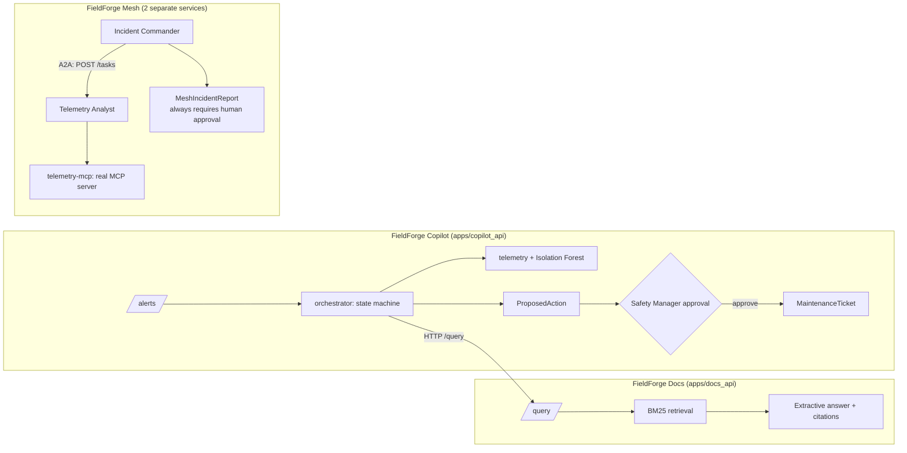

# FieldForge AI Suite

Three connected, production-shaped AI services for a fictional industrial operator —
grounded document Q&A, a human-supervised incident-investigation agent, and a
two-agent A2A/MCP investigation mesh — all running fully offline, all refusing or
escalating rather than guessing when evidence is thin, and every number below is
from an actual, reproducible run.

> This repo currently implements **FieldForge Docs**, **FieldForge Copilot**, and
> **FieldForge Mesh** (each vertical slice 1). Ops and Edge are designed (PRD-level)
> but not built — see [docs/ROADMAP.md](docs/ROADMAP.md).

## Measured results

**FieldForge Docs** — `evals/reports`, corpus = `data/samples/*.md` (7 docs)

| Metric | Value | Dataset |
|---|---|---|
| Recall@5 | 1.0 | `evals/datasets/docs_qa_v1.jsonl` (20 cases) |
| MRR | 0.903 | same |
| Refusal accuracy | 0.9 | same — see [limitation](#known-limitations) |
| Citation correctness (structural) | 1.0 | same |
| Latency p50 / p95 | ~2–5 ms | same, local, no network call |
| Guardrail adversarial accuracy | 1.0 (13/13) | `evals/datasets/guardrails_docs_v1.jsonl` |

**FieldForge Copilot** — `evals/reports`, 3-device synthetic fleet, 12 scenarios

| Metric | Value | Dataset |
|---|---|---|
| Goal-completion rate | 1.0 | `evals/datasets/copilot_scenarios_v1.jsonl` |
| Unauthorized-action prevention rate | 1.0 | same (RBAC on the approval endpoint) |
| Recovery-after-failure rate | 1.0 | same (unknown device, Docs API unreachable) |
| Human-decision handling rate | 1.0 | same (approve / reject / modify / idempotency) |

**FieldForge Mesh** — `evals/reports`, 2 real services, 11 scenarios

| Metric | Value | Dataset |
|---|---|---|
| Goal-completion rate | 1.0 | `evals/datasets/mesh_scenarios_v1.jsonl` |
| Delegation accuracy | 1.0 | same (correct classification via real A2A delegation) |
| Graceful-degradation rate | 1.0 | same (no agent, unreachable agent, unsupported task, unknown device) |
| Agent-discovery success rate | 1.0 | same (valid + deliberately-invalid discovery) |

Re-run any of these yourself: `make check` runs all three. Metrics not listed
(nDCG, faithfulness, tool-selection accuracy, cross-*agent* conflict resolution, ...)
are genuinely `TBD` — see
[docs/EVALUATION_METHODOLOGY.md](docs/EVALUATION_METHODOLOGY.md) for why, and what
unlocks them.

## Architecture



Docs: [docs/architecture/OVERVIEW.md](docs/architecture/OVERVIEW.md). Copilot:
[docs/architecture/COPILOT_OVERVIEW.md](docs/architecture/COPILOT_OVERVIEW.md). Mesh:
[docs/architecture/MESH_OVERVIEW.md](docs/architecture/MESH_OVERVIEW.md).

## Quick start

```bash
python -m venv .venv && .venv\Scripts\activate    # Windows; source .venv/bin/activate elsewhere
pip install -e ".[dev]"
python data/generators/generate_corpus.py
python data/generators/generate_telemetry.py

# Terminal 1 — Docs (Copilot's retrieve_sop tool calls this)
uvicorn fieldforge_docs_api.main:app --port 8000
# Terminal 2 — Copilot
uvicorn fieldforge_copilot_api.main:app --port 8010
# Terminal 3 — Mesh: Telemetry Analyst
uvicorn fieldforge_mesh_telemetry_agent.main:app --port 8021
# Terminal 4 — Mesh: Incident Commander
uvicorn fieldforge_mesh_commander.main:app --port 8022
```

Copilot demo — an FF-R07 methane alert investigated end-to-end, cross-checked
against the SOP FieldForge Docs is serving live:

```bash
curl -X POST http://localhost:8010/demo/scenarios/alert-2026-06-14/trigger
# -> {"state": "awaiting_approval", "classification": "likely_sensor_fault", ...}
curl http://localhost:8010/approvals   # copy the id
curl -X POST http://localhost:8010/approvals/<id>/decision \
  -H "Content-Type: application/json" -H "X-FieldForge-Role: safety_manager" \
  -d '{"decision":"approve"}'
# -> {"state": "completed", ...}; GET /tickets now shows the created ticket
```

Mesh demo — the same incident, investigated by two separate agent processes
talking A2A instead of one Python function calling another:

```bash
curl -X POST http://localhost:8022/agents/discover -H "Content-Type: application/json" \
  -d '{"endpoint":"http://localhost:8021"}'
curl -X POST http://localhost:8022/incidents -H "Content-Type: application/json" \
  -d '{"device_id":"FF-R07","value":1180,"triggered_at":"2026-06-14T14:32:21+00:00","window_seconds":42,"corroborating_device_id":"FIX-B3-02"}'
# -> {"safety_decision": "recommend_recalibration_pending_safety_review",
#     "requires_human_approval": true, "analyst_finding": {...}, "delegation_log": [...]}
```

Or run everything (lint, typecheck, tests, all three eval suites) in one shot: `make check`.

## Problem

Industrial field teams need fast, trustworthy answers from manuals and SOPs, fast
triage of sensor alerts, and coordinated investigation across specialized agents —
and a wrong or fabricated answer in any of these ("this reading is fine, resume the
robot") is a safety issue, not an inconvenience. Every product in this suite is built
around that constraint: Docs answers are extractive and cited; Copilot never takes a
state-changing action without a logged human approval; Mesh's Incident Commander has
*no execution capability at all* — it can only investigate and escalate.

## Why this is different from a demo RAG app / demo agent / demo multi-agent system

- **No API key required to run any service.** Docs is BM25 + a deterministic
  extractive adapter. Copilot and Mesh's only "model" is a real scikit-learn
  `IsolationForest` fit on synthetic telemetry — no LLM call anywhere in the default path.
- **The services actually talk to each other, over real processes.** Copilot's
  `retrieve_sop` and Mesh's Incident Commander both make genuine HTTP calls to peer
  services, not shared in-process imports. Kill any dependency and the caller
  degrades — tested, not asserted (`tests/unit/test_orchestrator.py`,
  `tests/integration/test_mesh_commander_api.py`).
- **`telemetry-mcp` is a real MCP server** built on Anthropic's official SDK — connect
  any MCP client to it, not just this suite's own agents.
- **Human approval is enforced server-side**, not in a UI. Copilot checks
  `X-FieldForge-Role: safety_manager` in the API layer; Mesh's Safety Officer sets
  `requires_human_approval=true` on every single code path, with no exception.
- **Every metric above is measured by the same script CI runs.** No separate "demo
  numbers" path.

## Features (implemented)

**FieldForge Docs**: `.txt`/`.md`/`.pdf` ingestion, fixed-token chunking with full
provenance, BM25 retrieval, input/retrieval/output guardrails, FastAPI with
correlation IDs.

**FieldForge Copilot**: explicit 12-state incident state machine, 6 investigation
tools, cross-service SOP retrieval, human-approval gate with server-enforced RBAC,
idempotent decisions, graceful degradation on tool/service failure.

**FieldForge Mesh**: 2 separately-deployable agents (Incident Commander, Telemetry
Analyst); real HTTP agent discovery (`/.well-known/agent-card`); A2A-shaped task
lifecycle with shared-secret auth; a real `telemetry-mcp` MCP server sharing its tool
implementations with the A2A path; disagreement-preserving incident reports; Safety
Officer policy that always requires human approval.

## Not yet implemented (planned, tracked in [docs/ROADMAP.md](docs/ROADMAP.md))

Docs: OCR, multimodal QA, Qdrant dense/hybrid retrieval, bilingual corpus, web UI,
full RBAC, live LLM adapter. Copilot: 11 of 17 program-brief tools, the ≥50-scenario
eval suite (currently 12), `PARTIAL`/`CANCELLED` states, retry/escalation. Mesh: 5 of
7 agent roles, 4 of 5 MCP servers, true cross-*agent* disagreement, async task
execution, the ~40-scenario eval suite (currently 11). Suite-wide: FieldForge Ops, Edge.

## Security

Threat model (STRIDE-flavored, all three products, implemented vs. planned):
[docs/threat-model/THREAT_MODEL.md](docs/threat-model/THREAT_MODEL.md). Adversarial/
scenario eval cases: [evals/datasets/](evals/datasets/). Reporting: [SECURITY.md](SECURITY.md).

## Known limitations

- **Docs refusal accuracy is 0.9, not 1.0** — BM25 has no semantic relevance floor, so
  two deliberately off-topic eval questions still score nonzero on shared common
  words instead of triggering a refusal. Disclosed in
  `services/retrieval/fieldforge_retrieval/sparse.py`, not hidden behind a threshold hack.
- **Copilot's eval set is 12 scenarios, Mesh's is 11** — not the program brief's ~50
  and ~40. Every one is a real end-to-end assertion; scaling up is tracked, not faked.
- **Mesh's "disagreement preservation" is between two signals from one analyst**
  (rule-based corroboration vs. model-based anomaly detection), not between two
  independent agents — a true cross-agent disagreement needs a second opinionated
  agent, which doesn't exist yet. Disclosed in
  [ADR 0003](docs/adr/0003-mesh-agent-protocol.md) decision 5.
- **Mesh's A2A protocol is hand-rolled**, following the public A2A vocabulary but not
  built on the `a2a-sdk` package — see ADR 0003 decision 2 for why, and what
  reconciling against the official spec would take.
- Small corpora/fleets (7 documents, 3 devices) — metrics are meaningful for this
  project's own regression testing, not representative of production scale.

## Data

All documents, devices, and telemetry are fictional, generated for this project —
see [DATA_CARD.md](DATA_CARD.md).

## Attribution

No external repository was used as a source for this codebase — see
[docs/INSPIRATION_AND_ATTRIBUTION.md](docs/INSPIRATION_AND_ATTRIBUTION.md) for the
full disclosure and third-party dependency license list.

## License

Apache-2.0 — see [LICENSE](LICENSE).
