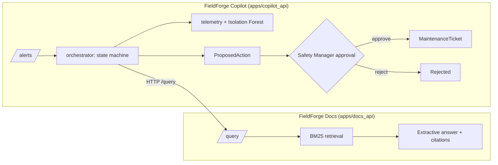

# FieldForge AI Suite

Two connected, production-shaped AI services for a fictional industrial operator —
grounded document Q&A and a human-supervised incident-investigation agent — both
running fully offline, both refusing rather than guessing when evidence is thin, and
every number below is from an actual, reproducible run.

> This repo currently implements **FieldForge Docs** (vertical slice 1) and
> **FieldForge Copilot** (vertical slice 1). Mesh, Ops, and Edge are designed
> (PRD-level) but not built — see [docs/ROADMAP.md](docs/ROADMAP.md).

## Measured results

**FieldForge Docs** — `evals/reports`, corpus = `data/samples/*.md` (7 docs)

| Metric | Value | Dataset |
|---|---|---|
| Recall@5 | 1.0 | `evals/datasets/docs_qa_v1.jsonl` (20 cases) |
| MRR | 0.903 | same |
| Refusal accuracy | 0.9 | same — see [limitation](#known-limitations) |
| Citation correctness (structural) | 1.0 | same |
| Latency p50 / p95 | ~2–5 ms | same, local, no network call |
| Guardrail adversarial accuracy | 1.0 (13/13) | `evals/datasets/guardrails_docs_v1.jsonl` |

**FieldForge Copilot** — `evals/reports`, 3-device synthetic fleet, 12 scenarios

| Metric | Value | Dataset |
|---|---|---|
| Goal-completion rate | 1.0 | `evals/datasets/copilot_scenarios_v1.jsonl` |
| Unauthorized-action prevention rate | 1.0 | same (RBAC on the approval endpoint) |
| Recovery-after-failure rate | 1.0 | same (unknown device, Docs API unreachable) |
| Human-decision handling rate | 1.0 | same (approve / reject / modify / idempotency) |

Re-run either yourself: `make eval` (Docs) or `python scripts/run_copilot_eval.py`
(Copilot). Metrics not listed (nDCG, faithfulness, tool-selection accuracy, agent
delegation accuracy, ...) are genuinely `TBD` — see
[docs/EVALUATION_METHODOLOGY.md](docs/EVALUATION_METHODOLOGY.md) for why, and what
unlocks them.

## Architecture



Docs' full diagrams: [docs/architecture/OVERVIEW.md](docs/architecture/OVERVIEW.md).
Copilot's full diagrams (component, sequence, state machine):
[docs/architecture/COPILOT_OVERVIEW.md](docs/architecture/COPILOT_OVERVIEW.md).

## Quick start

```bash
python -m venv .venv && .venv\Scripts\activate    # Windows; source .venv/bin/activate elsewhere
pip install -e ".[dev]"
python data/generators/generate_corpus.py
python data/generators/generate_telemetry.py

# Terminal 1 — Docs (Copilot's retrieve_sop tool calls this)
uvicorn fieldforge_docs_api.main:app --port 8000

# Terminal 2 — Copilot
uvicorn fieldforge_copilot_api.main:app --port 8010
```

Then run the flagship demo — an FF-R07 methane alert that turns out to be a probable
sensor fault, cross-checked against the SOP FieldForge Docs is serving live:

```bash
curl -X POST http://localhost:8010/demo/scenarios/alert-2026-06-14/trigger
# -> {"state": "awaiting_approval", "classification": "likely_sensor_fault", ...}

curl http://localhost:8010/approvals   # copy the id
curl -X POST http://localhost:8010/approvals/<id>/decision \
  -H "Content-Type: application/json" -H "X-FieldForge-Role: safety_manager" \
  -d '{"decision":"approve"}'
# -> {"state": "completed", ...}; GET /tickets now shows the created ticket
```

Or run everything (lint, typecheck, tests, both eval suites) in one shot: `make check`.

## Problem

Industrial field teams need fast, trustworthy answers from manuals and SOPs, and fast,
trustworthy triage of sensor alerts — and a wrong or fabricated answer in either case
("this reading is fine, resume the robot") is a safety issue, not an inconvenience.
Both products in this suite are built around that constraint: Docs answers are
extractive and cited; Copilot never takes a state-changing action without a logged
human approval.

## Why this is different from a demo RAG app / demo agent

- **No API key required to run either service.** Docs is BM25 + a deterministic
  extractive adapter. Copilot's only "model" is a real scikit-learn `IsolationForest`
  fit on synthetic telemetry — no LLM call anywhere in the default path.
- **The two services actually talk to each other.** Copilot's `retrieve_sop` tool is a
  real HTTP call to the Docs API, not a shared in-process import — see
  [ADR 0002](docs/adr/0002-copilot-agent-architecture.md). Kill the Docs API and
  Copilot degrades (no SOP evidence) instead of crashing — tested, not asserted.
- **Human approval is enforced server-side.** `POST /approvals/{id}/decision` checks
  `X-FieldForge-Role: safety_manager` in the API layer, not the UI — try it with the
  wrong role and get a 403, not a warning toast.
- **Every metric above is measured by the same script CI runs.** No separate "demo
  numbers" path.

## Features (implemented)

**FieldForge Docs**: `.txt`/`.md`/`.pdf` ingestion, fixed-token chunking with full
provenance, BM25 retrieval, input/retrieval/output guardrails (injection scanning on
both the query and every retrieved chunk), FastAPI with correlation IDs.

**FieldForge Copilot**: explicit 12-state incident state machine, 6 investigation
tools (device/telemetry lookup, Isolation Forest anomaly scoring, cross-service SOP
retrieval, ticket drafting), human-approval gate with server-enforced RBAC,
idempotent decisions (409 on replay), graceful degradation on tool/service failure.

## Not yet implemented (planned, tracked in [docs/ROADMAP.md](docs/ROADMAP.md))

Docs: OCR, multimodal QA, Qdrant dense/hybrid retrieval, bilingual corpus, web UI,
full RBAC, live LLM adapter. Copilot: 11 of the 17 program-brief tools, the
program brief's ≥50-scenario eval suite (currently 12), `PARTIAL`/`CANCELLED` states,
retry/escalation policy, web UI. Suite-wide: FieldForge Mesh, Ops, Edge.

## Security

Threat model (STRIDE-flavored, both products, implemented vs. planned):
[docs/threat-model/THREAT_MODEL.md](docs/threat-model/THREAT_MODEL.md). Adversarial/
scenario eval cases: [evals/datasets/](evals/datasets/). Reporting: [SECURITY.md](SECURITY.md).

## Known limitations

- **Docs refusal accuracy is 0.9, not 1.0** — BM25 has no semantic relevance floor, so
  two deliberately off-topic eval questions still score nonzero on shared common
  words instead of triggering a refusal. Disclosed in
  `services/retrieval/fieldforge_retrieval/sparse.py` and the eval methodology doc,
  not hidden behind a threshold hack.
- **Copilot's eval set is 12 scenarios, not 50.** Every one is a real end-to-end
  assertion; scaling to 50 is tracked, not faked.
- **Copilot's corroboration lookup uses a wider time window than the alert's own
  duration** (documented in `orchestrator.py`) because the synthetic fixed sensors
  sample every 10 minutes, not continuously — a real deployment's sensor sampling
  rate would inform this differently.
- Small corpora (7 documents, 3 devices) — metrics are meaningful for this project's
  own regression testing, not representative of production scale.

## Data

All documents, devices, and telemetry are fictional, generated for this project —
see [DATA_CARD.md](DATA_CARD.md).

## Attribution

No external repository was used as a source for this codebase — see
[docs/INSPIRATION_AND_ATTRIBUTION.md](docs/INSPIRATION_AND_ATTRIBUTION.md) for the
full disclosure and third-party dependency license list.

## License

Apache-2.0 — see [LICENSE](LICENSE).
