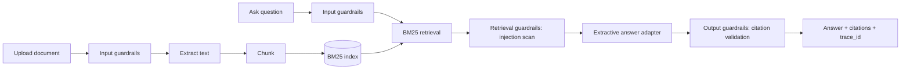

# FieldForge Docs

Grounded, cited question-answering over industrial technical documents — runs fully
offline, refuses when it lacks evidence, and every number in this README is from an
actual, reproducible run, not a claim.

> Part of the planned **FieldForge AI Suite** (Docs → Copilot → Mesh → Ops → Edge).
> This repository currently implements **FieldForge Docs, vertical slice 1** only —
> see [docs/ROADMAP.md](docs/ROADMAP.md) for what's built vs. planned across the suite.

## Measured results (slice 1, `evals/reports`, corpus = `data/samples`, 7 docs)

| Metric | Value | Dataset |
|---|---|---|
| Recall@5 | 1.0 | `evals/datasets/docs_qa_v1.jsonl` (20 cases) |
| MRR | 0.903 | same |
| Refusal accuracy | 0.9 | same — see [limitation](#known-limitations) below |
| Citation correctness (structural) | 1.0 | same |
| Latency p50 / p95 | ~2–5 ms | same, local machine, BM25 + extractive answer, no network call |
| Guardrail adversarial accuracy | 1.0 (13/13) | `evals/datasets/guardrails_docs_v1.jsonl` |

Re-run these yourself: `make eval` (or `python scripts/run_eval.py`). Numbers not listed
here (nDCG, faithfulness, multilingual retrieval, OCR robustness, cost/token metrics)
are genuinely `TBD` — see [docs/EVALUATION_METHODOLOGY.md](docs/EVALUATION_METHODOLOGY.md)
for why, and what unlocks them.

## Architecture



Full diagrams (component, sequence, trust boundaries): [docs/architecture/OVERVIEW.md](docs/architecture/OVERVIEW.md).

## Quick start

```bash
python -m venv .venv && .venv\Scripts\activate    # Windows; use source .venv/bin/activate on macOS/Linux
pip install -e ".[dev]"
python data/generators/generate_corpus.py
uvicorn fieldforge_docs_api.main:app --reload --port 8000
```

Then:

```bash
curl -F "file=@data/samples/manual_ff_r07_inspection_robot.md" http://localhost:8000/documents
curl -X POST http://localhost:8000/query -H "Content-Type: application/json" \
  -d '{"question": "At what methane reading does FF-R07 automatically stop?"}'
```

Or run everything (lint, typecheck, tests, eval) in one shot: `make check`.

## Problem

Industrial field teams need fast, trustworthy answers from manuals, SOPs, and
maintenance history — and a wrong or fabricated answer in this domain (e.g. "this
methane reading is fine, resume the robot") is a safety issue, not an inconvenience.
FieldForge Docs is built around that constraint: answers are extractive (quoted, not
generated text) by default, every claim is cited back to a real chunk, and the system
refuses rather than guesses when it can't find support.

## Why this is different from a demo RAG app

- **No API key required to run it.** Retrieval is BM25 (deterministic, offline);
  answer generation is a deterministic extractive adapter that literally cannot
  invent text — it only ever quotes retrieved, guardrail-passed chunks. A live LLM
  adapter is a defined interface, not wired in yet (see [ADR 0001](docs/adr/0001-monorepo-vertical-slice.md)
  for why that's a deliberate tradeoff, not a limitation nobody noticed).
- **Guardrails are wired into the retrieval path, not bolted on after.** Documents
  ingested into this repo's own corpus include a deliberately adversarial file
  (`data/samples/adversarial_prompt_injection_sample.md`) containing an embedded
  "SYSTEM: ignore all previous instructions" line — [evals/reports](evals/reports)
  shows the retrieval guardrail actually excluding it, on a real corpus entry, not a
  unit-test-only string.
- **Every metric above is measured, not asserted.** `scripts/run_eval.py` is the same
  script CI runs; there's no separate "demo numbers" path.

## Features (implemented in slice 1)

- Document ingestion: `.txt`, `.md`, `.pdf` (native text)
- Fixed-token chunking with full offset/page provenance
- BM25 sparse retrieval (provider-independent `EmbeddingAdapter` interface exists for
  a future dense retriever)
- Guardrails: file/type/size validation, PII/secret detection, prompt-injection
  scanning on both the query and every retrieved chunk, citation validation, refusal
  on insufficient evidence
- FastAPI API with correlation IDs and structured JSON logging
- Versioned eval datasets + scorer (Recall@k, MRR, refusal accuracy, citation
  correctness, latency) and a guardrail adversarial suite

## Not yet implemented (planned, tracked in [docs/ROADMAP.md](docs/ROADMAP.md))

OCR fallback, multimodal (tables/diagrams) QA, Qdrant dense/hybrid retrieval + RRF +
reranking, chunking-strategy benchmark, bilingual English/Arabic corpus + cross-lingual
eval, Next.js web UI, RBAC, OpenTelemetry tracing, live LLM adapter, and the Copilot /
Mesh / Ops / Edge products in the wider FieldForge AI Suite.

## Security

Threat model (STRIDE-flavored, mapped to what's implemented vs. planned):
[docs/threat-model/THREAT_MODEL.md](docs/threat-model/THREAT_MODEL.md). Adversarial
eval cases: [evals/datasets/guardrails_docs_v1.jsonl](evals/datasets/guardrails_docs_v1.jsonl).
Reporting: [SECURITY.md](SECURITY.md).

## Known limitations

- **Refusal accuracy is 0.9, not 1.0, and that's disclosed, not hidden.** Two
  eval cases ask deliberately off-corpus questions (forklift hydraulic fluid,
  quarterly revenue). BM25 has no semantic relevance floor — shared common words
  ("FieldForge", "Industries") give both queries a nonzero score against the tiny
  7-document corpus, so the system answers (extractively, with real citations to
  irrelevant chunks) instead of refusing. This is a genuine sparse-retrieval
  limitation, not a bug masked by a threshold hack — see the code comment in
  `services/retrieval/fieldforge_retrieval/sparse.py` and
  [docs/EVALUATION_METHODOLOGY.md](docs/EVALUATION_METHODOLOGY.md). A relevance
  gate (cross-encoder or LLM-judge faithfulness check) is planned for M2.
- Small corpus (7 synthetic documents) — retrieval metrics are meaningful for this
  project's own regression testing, not representative of production-scale corpora.
- English-only; no OCR; no dense/hybrid retrieval yet — see the Not-yet-implemented
  list above.

## Data

All documents are fictional, generated for this project — see
[DATA_CARD.md](DATA_CARD.md).

## Attribution

No external repository was used as a source for this codebase — see
[docs/INSPIRATION_AND_ATTRIBUTION.md](docs/INSPIRATION_AND_ATTRIBUTION.md) for the
full disclosure and third-party dependency license list.

## License

Apache-2.0 — see [LICENSE](LICENSE).
