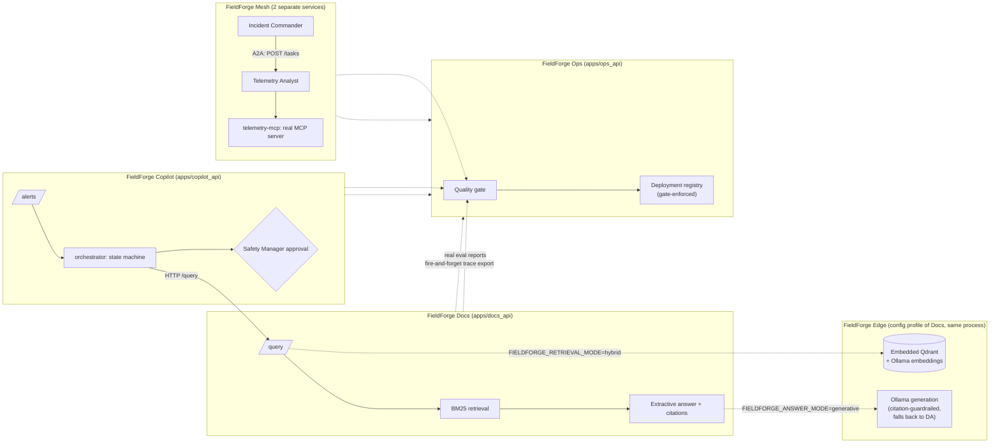

# FieldForge AI Suite

Five connected, production-shaped AI services for a fictional industrial operator —
grounded document Q&A, a human-supervised incident-investigation agent, a two-agent
A2A/MCP investigation mesh, the LLMOps control plane that evaluates and gates all
three, and an offline/edge deployment profile with real local embeddings and
generation — all running fully offline, all refusing or escalating rather than
guessing when evidence is thin, and every number below is from an actual,
reproducible run.

> This repo currently implements **FieldForge Docs**, **FieldForge Copilot**,
> **FieldForge Mesh**, **FieldForge Ops**, and **FieldForge Edge** (each vertical
> slice 1). See [docs/ROADMAP.md](docs/ROADMAP.md) for what's planned next.

## Measured results

**FieldForge Docs** — `evals/reports`, corpus = `data/samples/*.md` (7 docs)

| Metric | Value | Dataset |
|---|---|---|
| Recall@5 | 1.0 | `evals/datasets/docs_qa_v1.jsonl` (20 cases) |
| MRR | 0.903 | same |
| Refusal accuracy | 0.9 | same — see [limitation](#known-limitations) |
| Citation correctness (structural) | 1.0 | same |
| Latency p50 / p95 | ~2–5 ms | same, local, no network call |
| Guardrail adversarial accuracy | 1.0 (13/13) | `evals/datasets/guardrails_docs_v1.jsonl` |

**FieldForge Copilot** — `evals/reports`, 3-device synthetic fleet, 12 scenarios

| Metric | Value | Dataset |
|---|---|---|
| Goal-completion rate | 1.0 | `evals/datasets/copilot_scenarios_v1.jsonl` |
| Unauthorized-action prevention rate | 1.0 | same (RBAC on the approval endpoint) |
| Recovery-after-failure rate | 1.0 | same (unknown device, Docs API unreachable) |
| Human-decision handling rate | 1.0 | same (approve / reject / modify / idempotency) |

**FieldForge Mesh** — `evals/reports`, 2 real services, 11 scenarios

| Metric | Value | Dataset |
|---|---|---|
| Goal-completion rate | 1.0 | `evals/datasets/mesh_scenarios_v1.jsonl` |
| Delegation accuracy | 1.0 | same (correct classification via real A2A delegation) |
| Graceful-degradation rate | 1.0 | same (no agent, unreachable agent, unsupported task, unknown device) |
| Agent-discovery success rate | 1.0 | same (valid + deliberately-invalid discovery) |

**FieldForge Ops** — `tests/integration/`, real ingestion of the reports above, 29 tests

| Check | Result | Where |
|---|---|---|
| Quality gate: identical run passes | Pass | `test_ops_api.py::test_quality_gate_pass` |
| Quality gate: real regression fails | Fail (correctly) | `test_ops_api.py::test_quality_gate_fail_on_real_regression` |
| Deployment blocked on failing/missing gate | 409 (correctly) | `test_ops_api.py::test_deployment_blocked_*` |
| Full regression → fail → fix → pass → deploy → rollback sequence | All steps pass | `test_ops_regression_demo.py` |

**FieldForge Edge** — `evals/reports/edge_comparison_v1_report.json`, same
`docs_qa_v1` dataset, real local Ollama on this development machine (CPU-only)

| Config | recall@5 | MRR | refusal accuracy | citation correctness | latency p50 |
|---|---|---|---|---|---|
| sparse + extractive (slice-1 default) | 1.0 | 0.903 | 0.9 | 1.0 | 3.6ms |
| hybrid + generative (Edge, real Ollama) | 1.0 | 0.889 | 0.9 | 1.0 | 12,958ms |

| Local model | fallback rate (5 trials, two runs) | latency p50 |
|---|---|---|
| qwen2.5:0.5b | 1.0, then 0.4 on re-run | 5,710ms |
| qwen3:1.7b | 1.0, both runs | 2,600ms |

Both local models fell back to the deterministic extractive adapter on most or all
trials — a real, disclosed finding (the citation guardrail rejected most/all
generative output on this hardware), not a fabricated success number. The rate
itself isn't stable run-to-run (non-deterministic local generation, n=5 is small)
— see
[EDGE_OVERVIEW.md](docs/architecture/EDGE_OVERVIEW.md#local-model-comparison-5-trials-each)
for the full disclosure.

Re-run any of these yourself: `make check` runs the first four; `make edge-benchmark`
reproduces the Edge numbers (needs Ollama). Metrics not listed (nDCG, faithfulness,
tool-selection accuracy, cross-*agent* conflict resolution, drift detection, ...)
are genuinely `TBD` — see
[docs/EVALUATION_METHODOLOGY.md](docs/EVALUATION_METHODOLOGY.md) for why, and what
unlocks them.

## Architecture



Docs: [docs/architecture/OVERVIEW.md](docs/architecture/OVERVIEW.md). Copilot:
[docs/architecture/COPILOT_OVERVIEW.md](docs/architecture/COPILOT_OVERVIEW.md). Mesh:
[docs/architecture/MESH_OVERVIEW.md](docs/architecture/MESH_OVERVIEW.md). Ops:
[docs/architecture/OPS_OVERVIEW.md](docs/architecture/OPS_OVERVIEW.md). Edge:
[docs/architecture/EDGE_OVERVIEW.md](docs/architecture/EDGE_OVERVIEW.md).

## Quick start

```bash
python -m venv .venv && .venv\Scripts\activate    # Windows; source .venv/bin/activate elsewhere
pip install -e ".[dev]"
python data/generators/generate_corpus.py
python data/generators/generate_telemetry.py

# Terminal 1 — Docs (Copilot's retrieve_sop tool calls this)
uvicorn fieldforge_docs_api.main:app --port 8000
# Terminal 2 — Copilot
uvicorn fieldforge_copilot_api.main:app --port 8010
# Terminal 3 — Mesh: Telemetry Analyst
uvicorn fieldforge_mesh_telemetry_agent.main:app --port 8021
# Terminal 4 — Mesh: Incident Commander
uvicorn fieldforge_mesh_commander.main:app --port 8022
# Terminal 5 — Ops
uvicorn fieldforge_ops_api.main:app --port 8030
```

Copilot demo — an FF-R07 methane alert investigated end-to-end, cross-checked
against the SOP FieldForge Docs is serving live:

```bash
curl -X POST http://localhost:8010/demo/scenarios/alert-2026-06-14/trigger
# -> {"state": "awaiting_approval", "classification": "likely_sensor_fault", ...}
curl http://localhost:8010/approvals   # copy the id
curl -X POST http://localhost:8010/approvals/<id>/decision \
  -H "Content-Type: application/json" -H "X-FieldForge-Role: safety_manager" \
  -d '{"decision":"approve"}'
# -> {"state": "completed", ...}; GET /tickets now shows the created ticket
```

Mesh demo — the same incident, investigated by two separate agent processes
talking A2A instead of one Python function calling another:

```bash
curl -X POST http://localhost:8022/agents/discover -H "Content-Type: application/json" \
  -d '{"endpoint":"http://localhost:8021"}'
curl -X POST http://localhost:8022/incidents -H "Content-Type: application/json" \
  -d '{"device_id":"FF-R07","value":1180,"triggered_at":"2026-06-14T14:32:21+00:00","window_seconds":42,"corroborating_device_id":"FIX-B3-02"}'
# -> {"safety_decision": "recommend_recalibration_pending_safety_review",
#     "requires_human_approval": true, "analyst_finding": {...}, "delegation_log": [...]}
```

Ops demo — ingest the real eval reports from the other three products and run the
quality gate against their committed baselines:

```bash
python scripts/run_eval.py && python scripts/run_copilot_eval.py && python scripts/run_mesh_eval.py
python scripts/ingest_eval_reports.py --ops-url http://localhost:8030
# -> quality gate docs/docs_qa_v1: pass
#    quality gate copilot/copilot_scenarios_v1: pass
#    quality gate mesh/mesh_scenarios_v1: pass
```

Edge demo — same Docs process, toggled into offline hybrid retrieval + local
generative answers via env vars (needs Ollama with `nomic-embed-text` and a chat
model pulled):

```bash
FIELDFORGE_RETRIEVAL_MODE=hybrid FIELDFORGE_ANSWER_MODE=generative \
  uvicorn fieldforge_docs_api.main:app --port 8000
curl http://localhost:8000/edge/resources        # psutil + Ollama /api/ps snapshot
curl -X POST http://localhost:8000/edge/backup    # SQLite online-backup API
```

Or run everything (lint, typecheck, tests, all three products' eval suites) in one
shot: `make check`. Edge's comparison benchmark is separate (`make edge-benchmark`)
since it needs Ollama installed.

## Problem

Industrial field teams need fast, trustworthy answers from manuals and SOPs, fast
triage of sensor alerts, coordinated investigation across specialized agents, and a
way to know *before* deploying a change whether it made any of that worse — and a
wrong or fabricated answer in any of these ("this reading is fine, resume the
robot") is a safety issue, not an inconvenience. Every product in this suite is
built around that constraint: Docs answers are extractive and cited; Copilot never
takes a state-changing action without a logged human approval; Mesh's Incident
Commander has *no execution capability at all*; Ops physically blocks deploying a
regressed evaluation run.

## Why this is different from a demo RAG app / demo agent / demo LLMOps dashboard

- **No API key required to run any service.** Docs is BM25 + a deterministic
  extractive adapter. Copilot and Mesh's only "model" is a real scikit-learn
  `IsolationForest` fit on synthetic telemetry — no LLM call anywhere in the default path.
- **The services actually talk to each other, over real processes.** Copilot's
  `retrieve_sop` and Mesh's Incident Commander both make genuine HTTP calls to peer
  services; Ops collects real trace spans and real evaluation reports from all three.
  Kill any dependency and the caller degrades — tested, not asserted.
- **`telemetry-mcp` is a real MCP server** built on Anthropic's official SDK — connect
  any MCP client to it, not just this suite's own agents.
- **Human approval is enforced server-side**, not in a UI. Copilot checks
  `X-FieldForge-Role: safety_manager` in the API layer; Mesh's Safety Officer sets
  `requires_human_approval=true` on every single code path.
- **Ops' quality gate actually blocks deployment** — `POST /deployments` 409s if the
  linked evaluation run hasn't passed a gate. It found a real bug in its own logic
  (a faster, better latency was flagged as a regression) by being run against real
  data, not by a unit test written in advance — see [known limitations](#known-limitations).
- **Every metric above is measured by the same script CI runs.** No separate "demo
  numbers" path.

## Features (implemented)

**FieldForge Docs**: `.txt`/`.md`/`.pdf` ingestion, fixed-token chunking with full
provenance, BM25 retrieval, input/retrieval/output guardrails, FastAPI with
correlation IDs.

**FieldForge Copilot**: explicit 12-state incident state machine, 6 investigation
tools, cross-service SOP retrieval, human-approval gate with server-enforced RBAC,
idempotent decisions, graceful degradation on tool/service failure.

**FieldForge Mesh**: 2 separately-deployable agents (Incident Commander, Telemetry
Analyst); real HTTP agent discovery (`/.well-known/agent-card`); A2A-shaped task
lifecycle with shared-secret auth; a real `telemetry-mcp` MCP server sharing its tool
implementations with the A2A path; disagreement-preserving incident reports; Safety
Officer policy that always requires human approval.

**FieldForge Ops**: evaluation registry ingesting real reports from the other three
products; direction-aware quality gate (rate metrics higher-is-better, latency
lower-is-better); fire-and-forget trace export wired into all four products'
middleware; gate-enforced deployment/rollback registry.

**FieldForge Edge**: offline deployment profile of FieldForge Docs (env-var toggle,
not a separate service) — real local dense embeddings and RRF hybrid retrieval via
an embedded Qdrant index and Ollama, real local generative answers behind a
citation-validation guardrail that falls back to the deterministic extractive
adapter on any failure, resource monitoring (`GET /edge/resources`), and SQLite
online-backup-API-based backup/restore (`POST /edge/backup`, `/edge/restore`).

## Not yet implemented (planned, tracked in [docs/ROADMAP.md](docs/ROADMAP.md))

Docs: OCR, multimodal QA, bilingual corpus, web UI, full RBAC. Copilot: 11 of 17
program-brief tools, the ≥50-scenario eval suite (currently 12),
`PARTIAL`/`CANCELLED` states, retry/escalation. Mesh: 5 of 7 agent roles, 4 of 5 MCP
servers, true cross-*agent* disagreement, async task execution, the ~40-scenario
eval suite (currently 11). Ops: prompt registry (no live LLM to version prompts
for), real partial-canary traffic shifting, MLflow/OpenTelemetry integration, drift
monitoring, any web UI. Edge: encrypted local storage, local audit log, offline
English-Arabic retrieval, GPU/Jetson hardware profiles (both `TBD` — not available
in this environment), key rotation/authentication.

## Security

Threat model (STRIDE-flavored, all four products, implemented vs. planned):
[docs/threat-model/THREAT_MODEL.md](docs/threat-model/THREAT_MODEL.md). Adversarial/
scenario eval cases: [evals/datasets/](evals/datasets/). Reporting: [SECURITY.md](SECURITY.md).

## Known limitations

- **Docs refusal accuracy is 0.9, not 1.0** — BM25 has no semantic relevance floor, so
  two deliberately off-topic eval questions still score nonzero on shared common
  words instead of triggering a refusal. Disclosed in
  `services/retrieval/fieldforge_retrieval/sparse.py`, not hidden behind a threshold hack.
- **Copilot's eval set is 12 scenarios, Mesh's is 11** — not the program brief's ~50
  and ~40. Every one is a real end-to-end assertion; scaling up is tracked, not faked.
- **Mesh's "disagreement preservation" is between two signals from one analyst**, not
  between two independent agents — see [ADR 0003](docs/adr/0003-mesh-agent-protocol.md)
  decision 5. Mesh's A2A protocol is also hand-rolled, not built on the `a2a-sdk`
  package — see ADR 0003 decision 2.
- **Ops' quality gate had a real, now-fixed bug**: the first version applied
  "higher is better" to latency metrics, so a *faster* Docs run failed the gate.
  Fixed and covered by a regression test — see
  [ADR 0004](docs/adr/0004-ops-quality-gate.md) decision 1. Left in this list
  deliberately, as a disclosed example of the kind of bug real testing (not just
  unit tests written in advance) catches.
- **Ops' "deployment" and "canary" are a real, gate-enforced registry — not real
  infrastructure provisioning.** Nothing gets containerized or routed. See ADR 0004
  decision 3.
- **Edge's local generative answers fell back to extractive on every measured
  trial** (`fallback_rate: 1.0` for both qwen2.5:0.5b and qwen3:1.7b on this
  CPU-only development machine) — the citation guardrail is working as designed,
  but it means generative mode currently pays multi-second latency for the same
  citation-correctness as extractive. See
  [EDGE_OVERVIEW.md](docs/architecture/EDGE_OVERVIEW.md).
- **Edge had two real bugs found and fixed during development**: an Ollama host
  override that silently had no effect (module-level constant captured at first
  import, before a test's env-var override could take effect) and an arbitrary
  local file read via `/edge/restore` (no path-containment check on the requested
  backup path). Both fixed, both covered by regression tests, both documented in
  [ADR 0005](docs/adr/0005-edge-offline-profile.md) and the threat model.
- Small corpora/fleets (7 documents, 3 devices) — metrics are meaningful for this
  project's own regression testing, not representative of production scale.

## Data

All documents, devices, and telemetry are fictional, generated for this project —
see [DATA_CARD.md](DATA_CARD.md).

## Attribution

No external repository was used as a source for this codebase — see
[docs/INSPIRATION_AND_ATTRIBUTION.md](docs/INSPIRATION_AND_ATTRIBUTION.md) for the
full disclosure and third-party dependency license list.

## License

Apache-2.0 — see [LICENSE](LICENSE).
