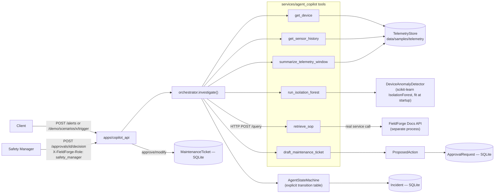
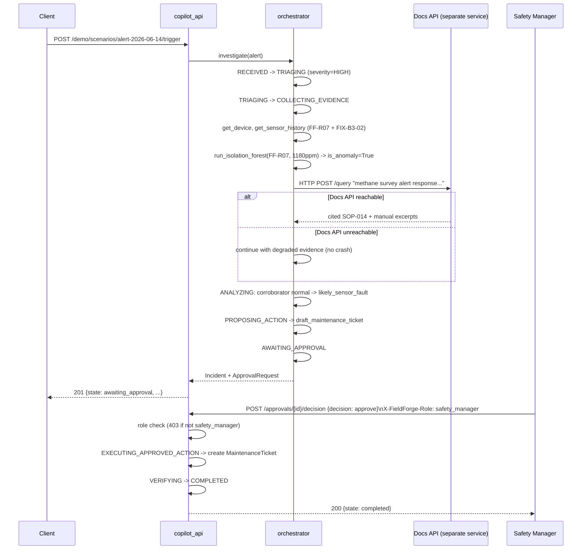
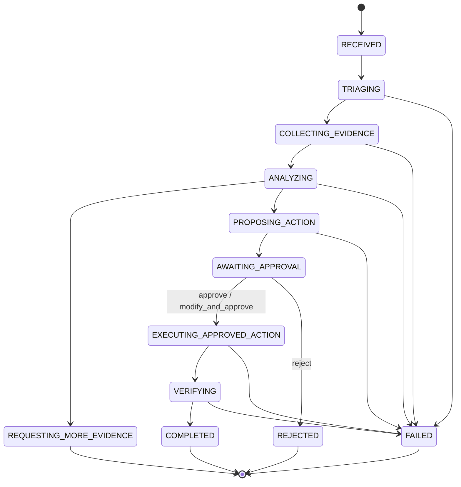

# Architecture — FieldForge Copilot (Slice 1)

Status: describes what is implemented today. See [ADR 0002](../adr/0002-copilot-agent-architecture.md)
for the reasoning behind each major decision below.

## Component diagram (Implemented)

## Sequence — flagship scenario end to end

## State machine (Implemented — 12 states)

Every arrow above is a literal entry in `services/agent_copilot/fieldforge_agent_copilot/state_machine.py`'s
transition table. Any transition not drawn here raises `InvalidTransitionError` — see
`tests/unit/test_state_machine.py`.

## Trust boundary: cross-service call to Docs

`retrieve_sop` is the one point where Copilot calls another FieldForge service over
the network rather than a local function. It is treated as untrusted-until-checked:
a non-200 response, a connection failure, or a `refused: true` body are all handled
explicitly (`ToolStatus.UNAVAILABLE` / `ERROR`), and the orchestrator never blocks
on it — see [ADR 0002](../adr/0002-copilot-agent-architecture.md) decision 2 and
`tests/unit/test_orchestrator.py::test_investigation_completes_without_crashing_when_docs_api_unavailable`.

## What's not implemented (planned)

- 11 of the 17 tools listed in the program brief (`check_camera_service`,
  `search_previous_incidents`, `send_operator_notification`, `request_service_restart`,
  `generate_incident_report`, etc.) — see [docs/ROADMAP.md](../ROADMAP.md).
- Voice briefing, English/Arabic summaries, incident replay UI, confidence-calibration
  view — all listed as "unique portfolio customizations" in the program brief, all
  deferred until the core agent loop above has a UI to sit behind.
- LangGraph / graph-framework orchestration — deferred to the Mesh milestone.
- Full RBAC — only the approval endpoint enforces a role today.
