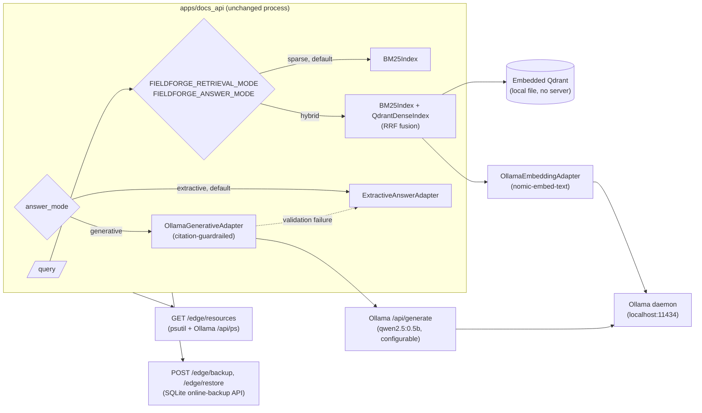
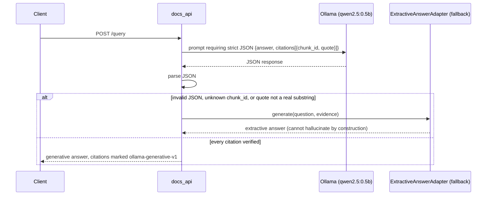

# Architecture — FieldForge Edge (Slice 1)

Status: describes what is implemented today. See
[ADR 0005](../adr/0005-edge-offline-profile.md) for the reasoning behind each choice.
Edge is a **configuration profile of FieldForge Docs**, not a separate service — see
ADR 0005 decision 3.

## Component diagram (Implemented)

## The citation guardrail — sequence

## Measured (this development machine, CPU-only — see limitations)

| Metric | Value |
|---|---|
| Embedding latency (warm, nomic-embed-text) | ~0.35s |
| Embedding latency (cold load) | ~6-7s |
| Generation throughput (warm, qwen2.5:0.5b) | ~47 tokens/sec |
| Generation latency (cold load) | ~6-7s |
| Dense index build, 11 chunks | ~15s (embedding each chunk) |
| Dense search (warm) | <1s |
| End-to-end hybrid+generative `/query` | ~13-17s (dominated by generation) |

### Retrieval-quality comparison (`docs_qa_v1` eval set, 10 cases)

| Config | recall@5 | MRR | refusal accuracy | citation correctness | latency p50 |
|---|---|---|---|---|---|
| sparse + extractive (slice-1 default) | 1.0 | 0.903 | 0.9 | 1.0 | 3.6ms |
| hybrid + generative (Edge) | 1.0 | 0.889 | 0.9 | 1.0 | 12,958ms |

### Local model comparison (5 trials each)

Two independent runs on this machine, same code, same models:

| Model | fallback rate (run 1) | fallback rate (run 2) | latency p50 (run 1) |
|---|---|---|---|
| qwen2.5:0.5b | 1.0 | 0.4 | 5,710ms |
| qwen3:1.7b | 1.0 | 1.0 | 2,600ms |

**Real finding, not a bug**: both models fell back to the extractive adapter on
most or all trials. The citation guardrail (see sequence diagram above) is working
as designed — neither local model reliably produces strict-JSON output with
citations that pass verbatim-substring validation, so most generative requests
fall back to the deterministic extractive answer instead of ever emitting an
unverified claim. **The rate itself is not stable run-to-run**: a second
fresh-clone verification run measured qwen2.5:0.5b's fallback rate at 0.4, not
1.0 — local generation is non-deterministic (temperature > 0, no fixed seed) and
n=5 trials is too small to pin down a precise rate. Treat these numbers as
directional (fallback happens often, latency is multi-second) rather than a
precise percentage. Practical effect either way:
`FIELDFORGE_ANSWER_MODE=generative` on this hardware pays multi-second generation
latency for citation correctness no better than extractive's near-instant result.
This is disclosed here rather than hidden — see
[EVALUATION_METHODOLOGY.md](../EVALUATION_METHODOLOGY.md) for the full write-up
and what would need to change (larger model, better prompt constraint, more
trials, or grammar-constrained decoding) to pin the rate down.

Full current numbers: `evals/reports/edge_comparison_v1_report.json`, produced by
`scripts/run_edge_comparison_eval.py`. Re-run it yourself; nothing here is estimated.

## Hardware profiles

| Profile | Status |
|---|---|
| CPU-only (this development machine) | Measured — see table above |
| NVIDIA GPU workstation | **TBD** — not available in this environment |
| NVIDIA Jetson | **TBD** — not available in this environment |

Per the program brief's explicit prohibition on invented benchmark values, the GPU
and Jetson rows are not estimated from the CPU numbers. They stay `TBD` until
measured on that hardware.

## What's not implemented (planned)

- Encrypted local document storage — see [ADR 0005](../adr/0005-edge-offline-profile.md)
  decision 6 for why this is deferred rather than half-built.
- Local audit log — duplicates what FieldForge Ops already provides at the suite level.
- Offline English-Arabic retrieval — no Arabic corpus exists yet (Docs M2 item).
- Network-disconnection / cloud-sync-conflict simulation — no real cloud deployment
  exists to conflict with; simulating one would be exactly the "fake terminal
  animation" the program brief prohibits.
- Real GPU/Jetson benchmarking — needs that hardware.
- Encrypted-at-rest key rotation, user authentication — suite-wide RBAC is deferred
  everywhere, not specific to Edge.
