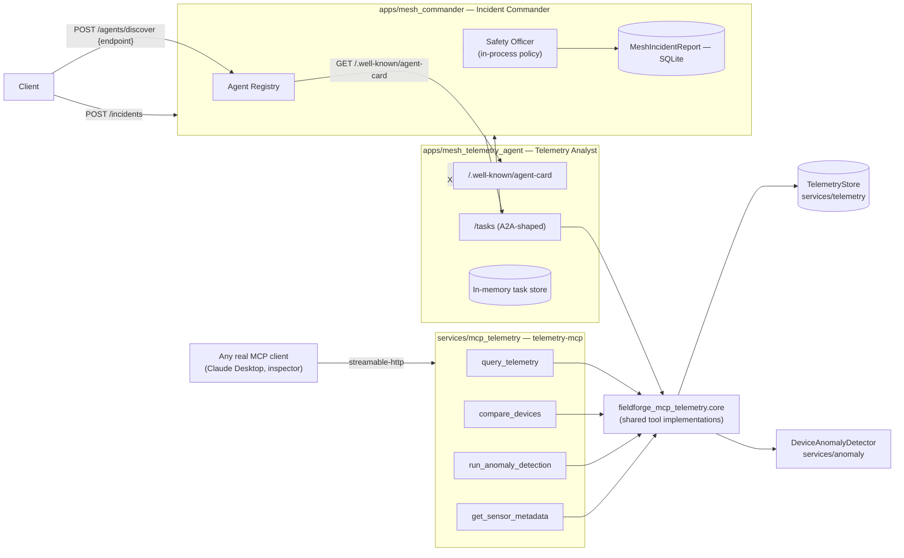
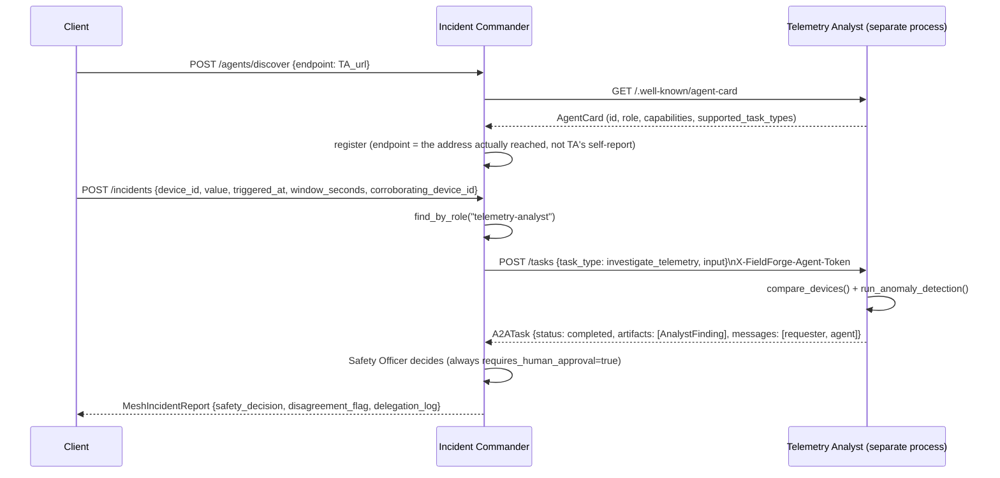
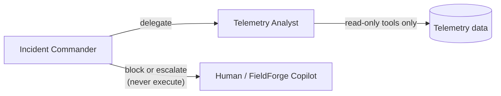

# Architecture — FieldForge Mesh (Slice 1)

Status: describes what is implemented today. See
[ADR 0003](../adr/0003-mesh-agent-protocol.md) for the reasoning behind each choice.

## Component diagram (Implemented)

`fieldforge_mcp_telemetry.core` is called by both the MCP server (`server.py`) and the
Telemetry Analyst's A2A HTTP handler — one implementation, two transports (ADR 0003
decision 3). `services/telemetry` and `services/anomaly` are shared with FieldForge
Copilot (extracted there once Mesh needed them too).

## Sequence — flagship scenario, real cross-process delegation

## Trust boundary: Commander never executes

Telemetry Analyst's tools are all read-only. Incident Commander has no write
capability at all in this slice — every `MeshIncidentReport.requires_human_approval`
is `true` (see `apps/mesh_commander/fieldforge_mesh_commander/safety_officer.py`).
Executing an approved action is FieldForge Copilot's job, not Mesh's — the two
products intentionally don't duplicate that responsibility.

## Permission matrix (slice 1)

| Agent | Can read telemetry | Can delegate | Can execute actions | Can approve |
|---|---|---|---|---|
| Telemetry Analyst | Yes (own data only) | No | No | No |
| Incident Commander | Via delegation only | Yes | **No — never** | No |
| Human / Safety Manager | Via reports | — | Via FieldForge Copilot | Yes |

## What's not implemented (planned)

- Document Intelligence, Vision Inspection, Maintenance Planner, Safety Officer (as
  its own service), Report Agent — see [docs/ROADMAP.md](../ROADMAP.md).
- `documents-mcp`, `robot-health-mcp`, `maintenance-mcp`, `deployment-mcp`.
- True cross-*agent* disagreement (this slice demonstrates disagreement between two
  signals from one analyst — see ADR 0003 decision 5).
- Async task execution / real task polling (tasks complete synchronously today —
  ADR 0003 decision 6).
- OAuth/mTLS agent-to-agent auth (static shared-secret token today).
