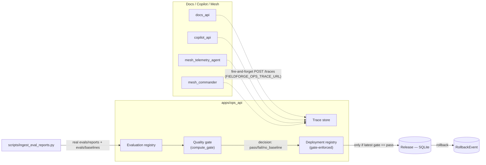
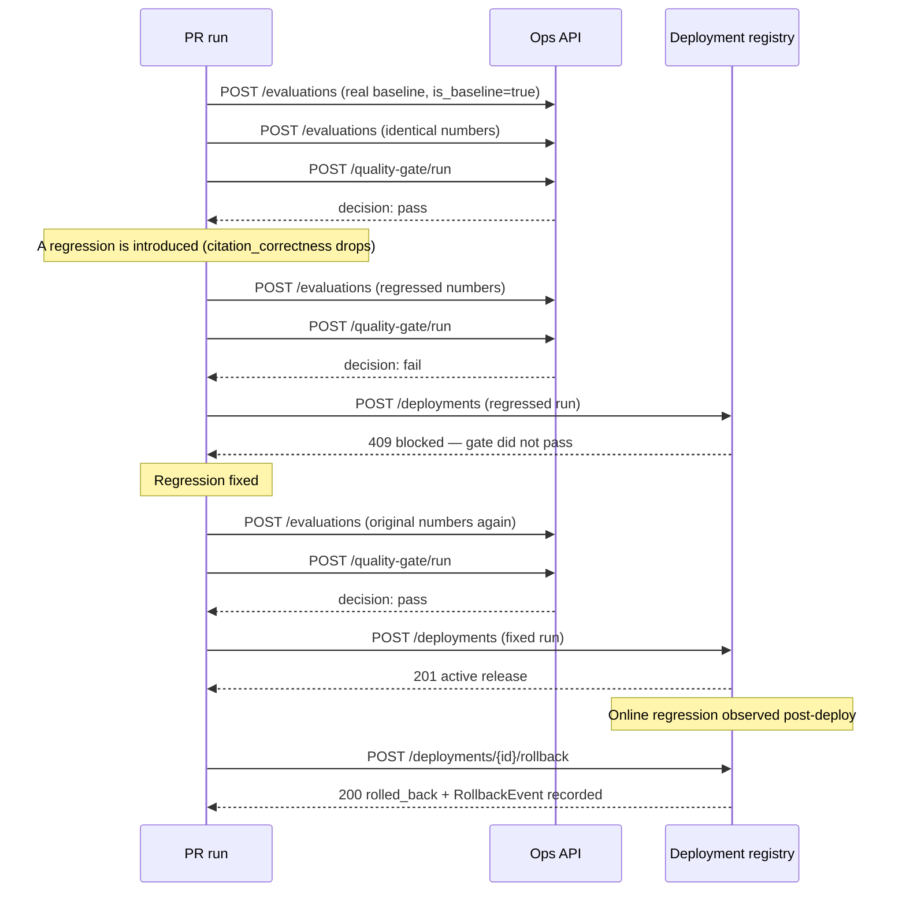
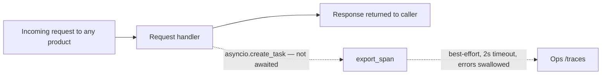

# Architecture — FieldForge Ops (Slice 1)

Status: describes what is implemented today. See
[ADR 0004](../adr/0004-ops-quality-gate.md) for the reasoning behind each choice.

## Component diagram (Implemented)

Dashed arrows are fire-and-forget: if Ops is down, the product being observed never
knows and never fails because of it (ADR 0004 decision 2).

## Sequence — the CI/CD regression demonstration

The program brief calls this sequence "a primary portfolio feature." It runs as a
real test (`tests/integration/test_ops_regression_demo.py`) against real Ops API
code, seeded from the actual committed Docs baseline — not simulated end to end in
GitHub Actions (ADR 0004 decision 4).

## Trust boundary: trace export never blocks the caller

`export_span()` schedules the HTTP POST as a fire-and-forget asyncio task (or a
short-timeout synchronous call outside an event loop) and never raises. Response
latency and correctness for the product being observed are unaffected whether Ops
is up, down, or slow.

## A real bug this design caught

The quality-gate policy originally applied "higher is better" to every metric,
including latency. A genuinely *faster* Docs run (1.98ms vs. a 2.16ms baseline) was
reported as a failing regression. Found by running `scripts/ingest_eval_reports.py`
against the real committed reports — not by a unit test written in advance. Fixed
in `apps/ops_api/fieldforge_ops_api/gate.py::_is_lower_better`; the specific case is
now a regression test (`tests/unit/test_gate.py::test_faster_latency_passes_not_flagged_as_regression`).
See [ADR 0004](../adr/0004-ops-quality-gate.md) decision 1.

## What's not implemented (planned)

- Prompt registry, prompt versioning/aliases — no live LLM adapter exists yet to
  version prompts for (Docs' extractive adapter and Copilot/Mesh's rule-based
  policies have no prompts).
- Dataset versioning beyond the `dataset_version` field already on every run.
- MLflow / OpenTelemetry integration — trace export today is a minimal bespoke
  span record, not a full OTel pipeline.
- Real partial-canary traffic shifting — `Release.canary_percent` exists as a field
  but nothing currently acts on it besides defaulting to 100.
- Drift monitoring (query-topic drift, retrieval-score drift, etc.) — needs
  production traffic volume this slice doesn't have.
- A trace-explorer UI — the API exists; there's no web frontend yet for any product.
