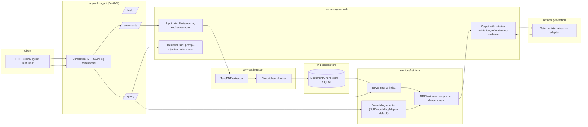
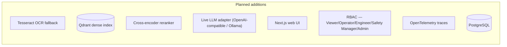
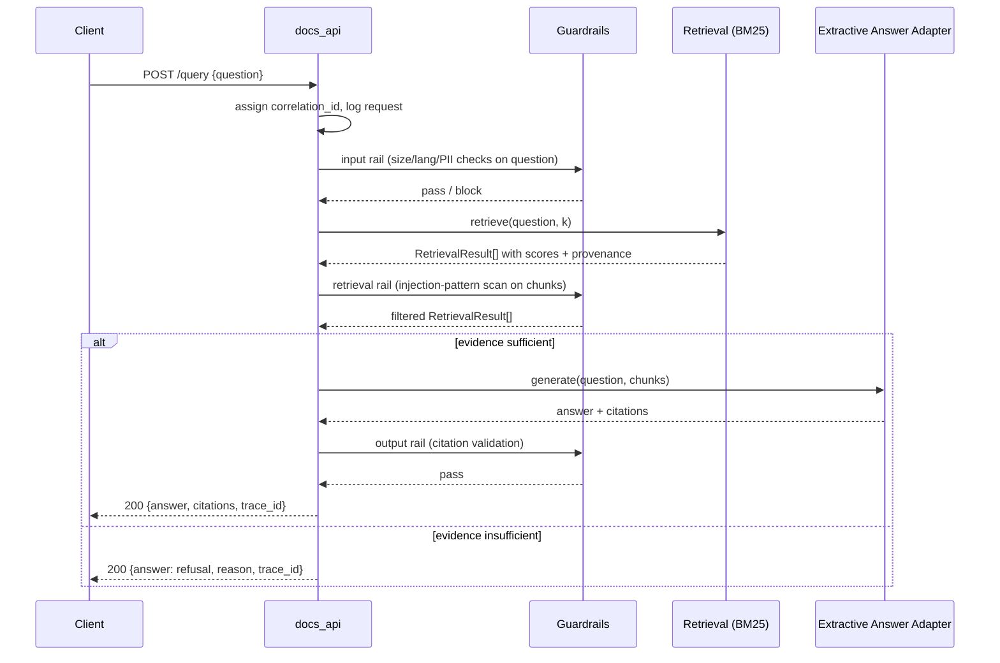
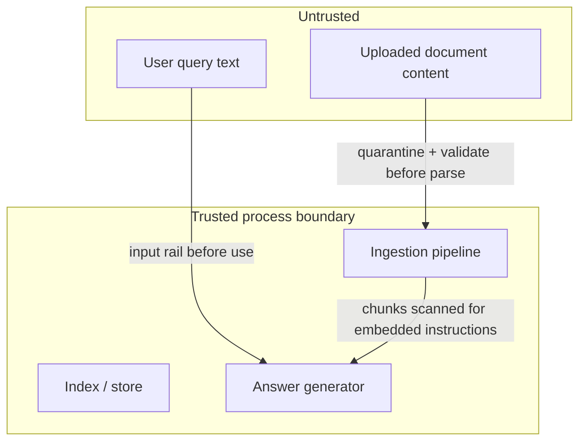

# Architecture — FieldForge Docs (Slice 1)

Status: **Implemented** sections describe what runs today. **Planned** sections describe the
target architecture for milestone M2+ and are not yet built.

## Component diagram (Implemented, slice 1)

## Component diagram (Planned, M2+)

## Request sequence — `/query` (Implemented)

## Trust boundaries

Retrieved chunk text is **data**, never instructions — the retrieval rail strips/flags
imperative-toward-the-model patterns found inside document content before it reaches the
answer step. See [threat model](../threat-model/THREAT_MODEL.md).

## Data model (slice 1, implemented subset)

See [packages/contracts](../../packages/contracts/fieldforge_contracts) for the authoritative
Pydantic definitions. Implemented now: `Document`, `DocumentPage`, `Chunk`, `RetrievalResult`,
`Citation`, `EvaluationCase`, `EvaluationResult`. Planned (Copilot/Mesh milestones): `Device`,
`Sensor`, `TelemetryPoint`, `Alert`, `Incident`, `Evidence`, `AgentTask`, `AgentMessage`,
`ToolRequest`, `ToolResult`, `ApprovalRequest`, `ApprovalDecision`, `MaintenanceTicket`,
`ModelRun`, `TraceReference`.

## Why BM25-first instead of dense-first

Dense retrieval needs an embedding provider (API key or a local model). Slice 1's non-functional
requirement is "runs offline with zero external services." BM25 is deterministic, dependency-light
(`rank_bm25`), and gives a real, measurable baseline immediately. The `EmbeddingAdapter` interface
is defined so a dense adapter (Ollama-served embedding model, or a cloud provider) can be added
without changing the retrieval or API layer — see `services/retrieval/fieldforge_retrieval/embedding.py`.
This is the same graceful-degradation posture the suite requires end-to-end: prefer a real, weaker
answer over a fabricated strong one.
